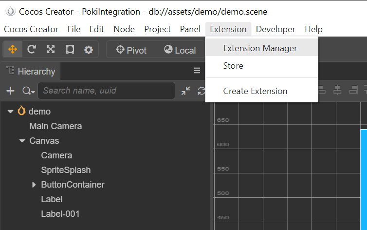
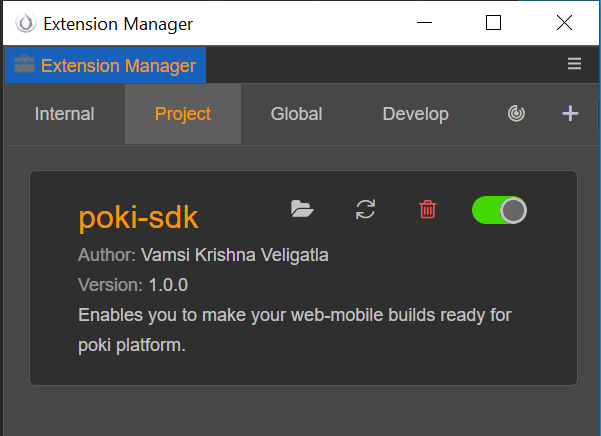

# Poki Extension for Cocos Creator 3.x
`Note: This extension works for CocosCreator3.4.0 and above only`

This extension makes it easy to integrate the poki's [HTML5 SDK](https://sdk.poki.com/html5/) into your Cocos Creator(3.x) game. You can create custom build and preview templates to do the integration by yourself, but the extension provides them ready to use. 

The extension provides:
- preview template 
- web-mobile build template
- PokiSDK abstraction 
- Demo scene showcasing usage

Once you install and enable the extension, you will be able to test the poki sdk integration in preview mode (in browser) and be able to make builds(web-mobile) that can be uploaded to poki platform. 

## 1.Installation
You should be able to download and install the extension in two ways

### Cocos Store
You can search and install the extension directly from the cocos store. 
This is the easiest way to get started with the extension. 
//screenshots of the store and install process. 

### From Source
In your project's root directory, create a directory named *extensions*. 
clone this repo under the *extensions* directory using command

``` git clone https://github.com/vkbsb/cocos-creator-poki-sdk ```

## 2.Enable extension
Once you have done the installation go to the extensions manager and ensure that the 
poki-build extension is enabled. 
open extension manager


Under project tab, ensure that poki-sdk is enabled. If it's not enabled, enable it. 


The extension creates the following files in your project directory.
- preview-template/index.ejs
- build-templates/common/application.ejs
- build-templates/web-mobile/index.ejs
- assets/poki-api/SiteLock.js
- assets/poki-api/PokiPlatform.ts
- assets/demo/demo.scene
- assets/demo/DemoScript.ts


## 3.Usage 
In your component scripts, you will be able to import CCPokiSDK and use it to interact with the PokiSDK. The following are the functions that are available for you to use from your game scripts. Checkout the DemoScript.ts for example usage.

```typescript
CCPokiSDK.gameplay_start() //-- in JS it's PokiSDK.gameplayStart()
CCPokiSDK.gameplay_stop() //-- in JS it's PokiSDK.gameplayStop()
CCPokiSDK.commercial_break() //-- in JS it's PokiSDK.commercialBreak()
CCPokiSDK.rewarded_break() //-- in JS it's PokiSDK.rewardedBreak()
CCPokiSDK.shareable_url(params, callback) //-- in JS it's PokiSDK.shareableURL({}).then(url => {})
local value = CCPokiSDK.get_url_param(key) //-- in JS it's PokiSDK.getURLParam('id')
CCPokiSDK.isAdBlocked()  //-- in JS it's PokiSDK.isAdBlocked()
```

You will notice that you do not see an equivalent to ``PokiSDK.set_debug(value)`` this is because the extension sets this automatically based on the build you make. 


**SiteLock**

Poki provides a sitelock code to the developers which helps ensure that the game is playable only on poki's website. Please collect it from your dev contact. Once you get it, paste the code in the ``SiteLock.js`` file at the appropriate location.

The following code snippet shows the contents of SiteLock.js file
```typescript
function SiteLock(){
    //Paste you Poki SiteLock Code Below. 
    
}

module.exports = {
    init: SiteLock
}
```

**Generate Build**
You will need to make ``web-mobile`` build for the extension to do the poki sdk integration. 
#TODO screentshots for web-mobile web creation.
